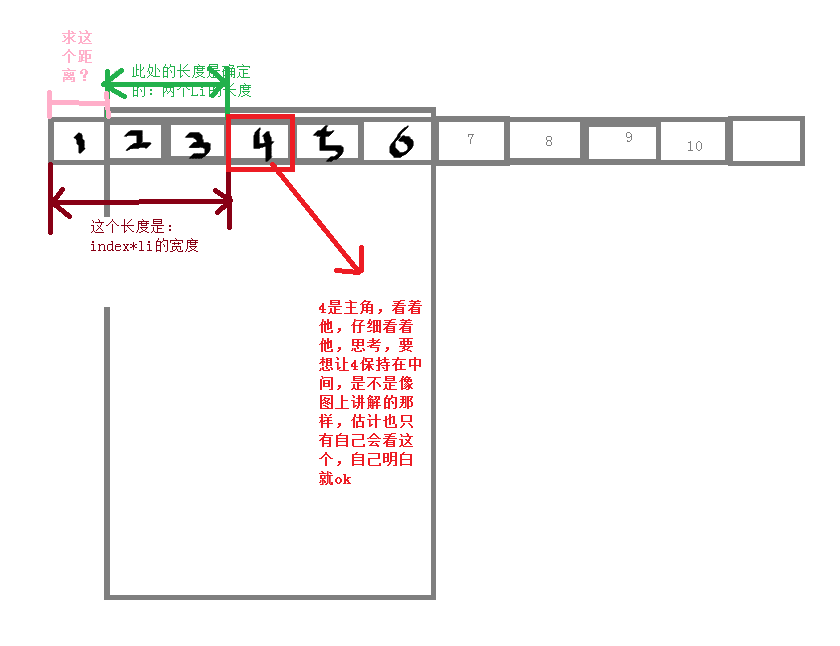

---
title: 模仿腾讯视频的可以滑动的导航
---

# 腾讯视频的可以滑动的导航

首先简单介绍一下这个导航的功能：能够左右滑动，选中每个导航，这个内容会滑到中间，当然除了左右两个边界，没地方跳，只好就保持在边界上。

### 用到的技术:
1. vue
2. better-scroll

#### html代码
```
    <template>
        <div>
            <div class="mv-tabs">
                <div class="tabs" ref="tabsWrapper">
                    <ul ref="movetabsum">
                        <li ref="tab"  class="tab-link"  v-for="(item, index) in tabs" :key="index" @click="selectItem(index,$event)">
                        <router-link tag="div" :to="item.to"   class="tab-item" >
                            <span>{{item.title}}</span>
                        </router-link>
                        </li>
                    </ul>
                </div>
            </div>
            <router-view></router-view>
        </div>
    </template>
```
#### js代码
```
<script>
   // 引入better-scroll ；这个需要安装
    import  BScroll from 'better-scroll'; 
    export default{
        data () {
            return {
                // tabs是菜单的个数，一般是后台获取的，此处是模拟
                tabs: [
                    {
                    to: '/recommend',
                    title: '推荐'
                    },
                    {
                    to: '/music',
                    title: '音乐'
                    },
                    {
                    to: '/show',
                    title: 'Show'
                    },
                    {
                    to: '/quadratic',
                    title: '二次元'
                    },
                    {
                    to: '/dance',
                    title: '舞蹈'
                    },
                    {
                    to: '/game',
                    title: '游戏'
                    },
                    {
                    to: '/mv',
                    title: 'mv'
                    }, 
                    {
                    to: '/fashion',
                    title: '时尚'
                    }, 
                    {
                    to: '/life',
                    title: '生活'
                    }, 
                    {
                    to: '/funny',
                    title: '搞笑'
                    }, 
                    {
                    to: '/news',
                    title: '新闻'
                    },                
                    {
                    to:'/novel',
                    title:'小说'    
                    }
                ],
                mX: 0, // ul移动（translate）的距离
                tabWidth: 0 // 每个tab(li)的宽度,下面有讲怎么设置，接着看
            }
        },
        mounted(){
            // vue数据更新后，会触发
            this.$nextTick(()=>{
                this._initMenu()
            })
        },
        methods: {
            _initMenu () {
                // 获取li的宽度，因为我css写的li的宽度是20vw，屏幕上可见5个菜单；所以会根据不同的屏幕大小变化，所以用js获取
                this.tabWidth = this.$refs.movetabsum.children[0].offsetWidth;
                let tabsWidth = this.tabWidth;  //简单的赋值，没什么好说的
                let width = this.tabs.length * tabsWidth  //求出ul的宽度 = 每个li的宽度 * li的个数；（小学数学）
                this.$refs.movetabsum.style.width = `${width}px` //设置ul的宽度（movetabsum用来标记ul，相当于获取ul的DOM）
            this.$nextTick(() => {
                if (!this.scroll) {
                    this.scroll = new BScroll(this.$refs.tabsWrapper, {
                        scrollX: true, //横向滑动开启
                        eventPassthrough: 'vertical' // 忽略这个实例对象的垂直滑动事件
                    })
                } else {
                    this.scroll.refresh()
                }
              })
            },
            selectItem (index,event) {
                let movetabsum = this.$refs.movetabsum;
                // 获取ul的translateX的值
                let moveX = +movetabsum.style.transform.replace(/[^0-9\-,]/g, '').split(',')[0];
                // 判断ul的translateX的值，此处是需要思考的地方，下面详细讲
                if(index >= 0 && index <=2){
                    this.mX = 0;
                }else if(index >= this.tabs.length-3){
                    this.mX = (this.tabs.length-5) * this.tabWidth;
                    this.mX = -this.mX;
                }else if(index > 2 && index < this.tabs.length-3){
                    this.mX = index * this.tabWidth - this.tabWidth * 2;
                    this.mX = -this.mX;
                }
                // 设置ul的translateX的值
                movetabsum.style.transform = `translate(${this.mX}px, 0)`;
                //给ul加一个过度，要不一跳一跳的，太闪了，用户体验不好
                movetabsum.style.transition = 'all 0.6s';
            }            
        }

    }
</script>
```
### 下面细讲怎么求出ul的translateX
     1. 想考虑边界值，因为我们定的是手机屏幕可见5个菜单，所以第三个菜单本省就是在中间，
        所以前三个1,2,3是ul的translateX 为0;依次类推点击倒数后三个的时候ul的translateX
        为tabs.length - 5;只要想把倒数5个都放在屏幕上，当然ul的translateX就是所有的li-5个;
     2. 然后接着想中间的值范围，此处需要一张图

### 
#### css代码
```
    <style type="text/css">
        *{
            margin:0 ;
            padding:0;
            list-style:none;
        }
        .mv-tabs{
            width:100%;
            border-top:1px solid #ccc;
            border-bottom:1px solid #ccc;
        }
        .mv-tabs .tabs{
            height :2.5rem;
            width :100%;
            line-height: 2.5rem;
            box-sizing :border-box;
            overflow :hidden;
            white-space: nowrap;   
        }
        .mv-tabs .tabs ul{
            display:flex;
            white-space: nowrap;
            width:auto;
        }
        .mv-tabs .tabs ul li{
            flex-shrink:0;
            width:20vw;
            height: 40px;
        }
        .mv-tabs .tabs .tab-item{
            width:100%;
            height:100%;
            text-align :center;   
        }
        .mv-tabs .tabs .tab-item .tab-link{
            padding-bottom :5px;
            color :#333333;    
            font-size:16px;   
        } 
        .router-link-active{
            color :#d33a31;
            box-sizing: border-box;
            transition: all 0.1s linear;
            font-size:26px;
            background-color: #f9f9f9;
        }

    </style>
```

